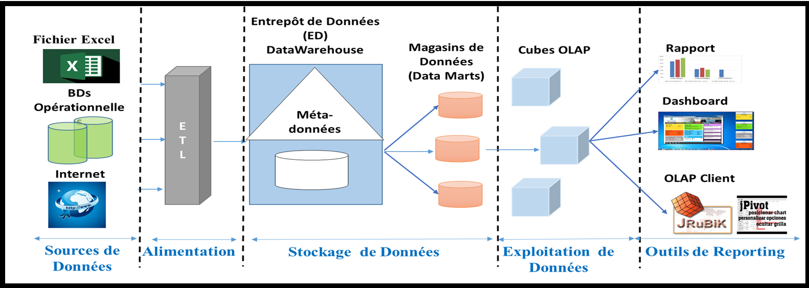
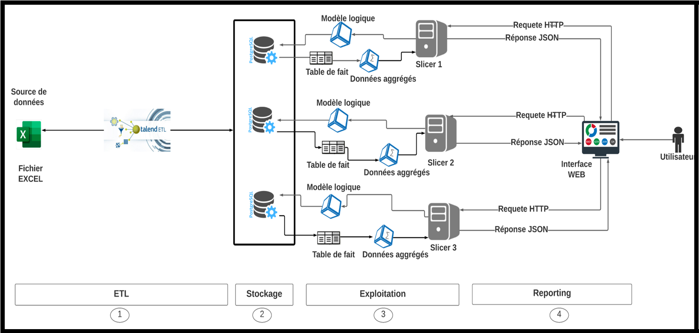
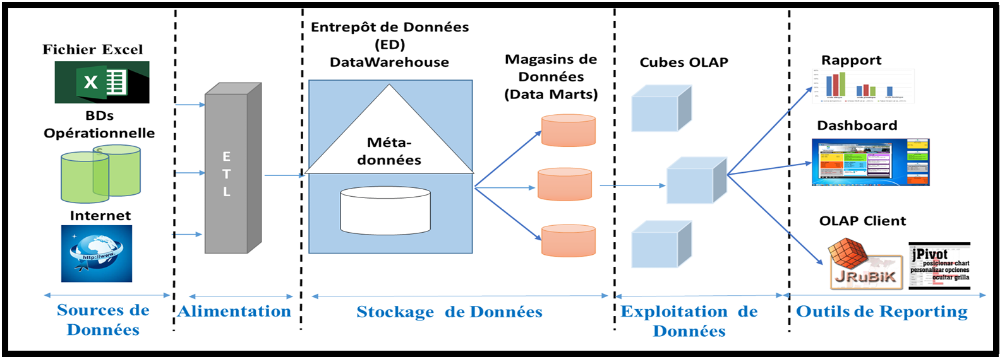
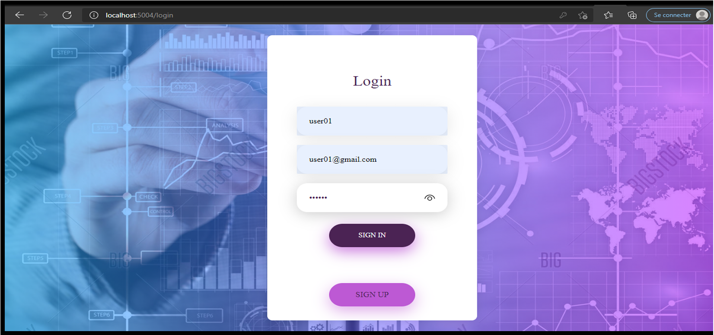
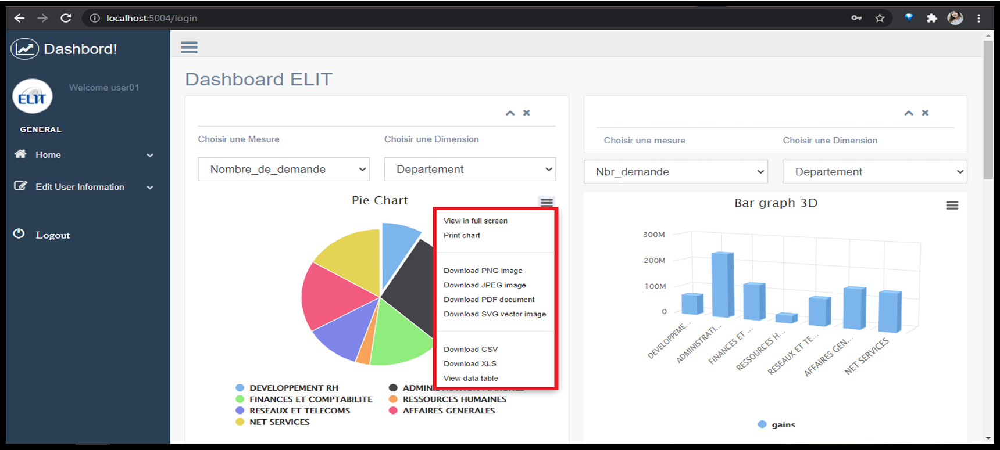
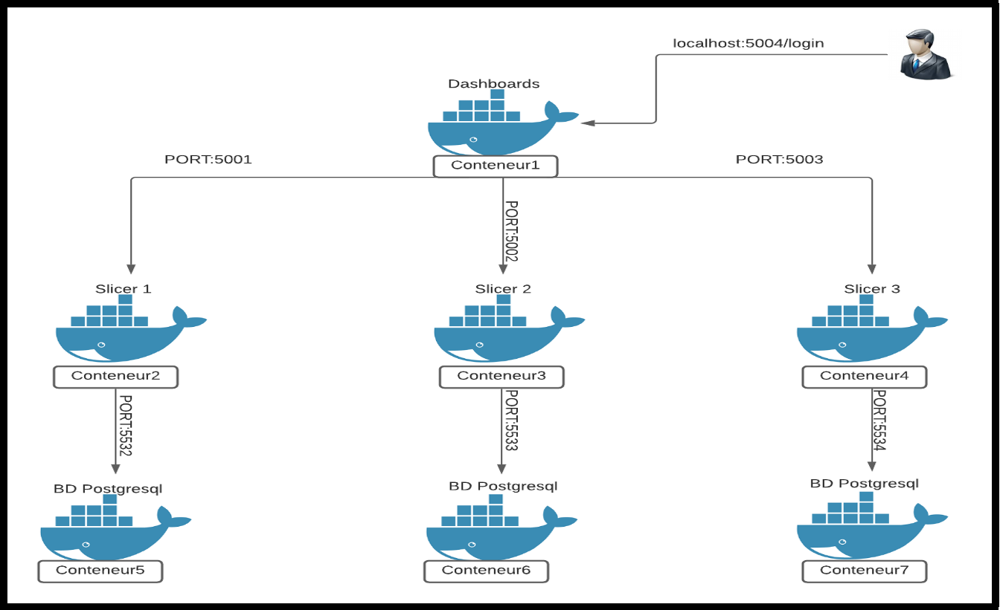

# 📊 Système d’Aide à la Décision pour la Gestion du Datacenter d’ELIT (SONELGAZ)

Ce dépôt contient le code source et les ressources du Projet de Fin d’Études intitulé :

**« Conception et réalisation d’un système d’aide à la décision pour les tâches d’administration du Datacenter au niveau d’ELIT »**

Ce projet a été réalisé à **ELIT – Filiale du groupe SONELGAZ**, dans le cadre du master **Mathématiques et Informatique Décisionnelle** à l’USTHB.


---

## 🚀 Objectifs du projet

L’objectif principal est de faciliter la prise de décision au sein du département **DISI** d’ELIT, grâce à :

- La mise en place d’un **système Business Intelligence** dédié au Datacenter.
- La réalisation d’un **client OLAP web** interactif permettant de :
  - Analyser les demandes de services informatiques.
  - Suivre les demandes d’infrastructure.
  - Gérer la création et la consommation des machines virtuelles.
- L’automatisation du **reporting** et la génération de **tableaux de bord**.
- Le déploiement complet de la solution via **Docker**.

---

## 🏗️ Architecture générale

La solution repose sur 4 modules principaux :

1. **ETL (Talend Open Studio)**  
2. **Stockage – DataMart & Cubes OLAP**  
3. **Serveur OLAP – Mondrian / Slicer**  
4. **Client OLAP Web**

---

## 🛠️ Technologies utilisées

| Domaine                     | Outils / Technologies |
|----------------------------|------------------------|
| ETL                        | Talend Open Studio     |
| Entrepôt de données        | PostgreSQL / MySQL     |
| Cube OLAP                  | Mondrian – Schema XML  |
| Serveur OLAP/API           | Slicer / WSGI          |
| Interface web              | HTML / CSS / JS / AJAX |
| Conteneurisation           | Docker & Docker-Compose|

---


---

## 🖥️ Fonctionnalités principales

### ✔️ Interface utilisateur
- Authentification et gestion des profils
- Dashboard interactif
- Sélection de dimensions et mesures
- Filtrage dynamique

### ✔️ Analyses disponibles
- Demandes de services informatiques  
- Demandes d’infrastructures  
- Créations de machines virtuelles  
- Suivi des ressources allouées  

### ✔️ Reporting
- Export PDF / Excel / CSV
- Impression
- Génération automatique des rapports


---

## 🐳 Déploiement avec Docker

### Exécution :
```
docker-compose up --build -d
```

---

## 👨‍💻 Auteurs

- **MAHNI Hocine**
- **MEZRAG Randa**

---

## 📚 Référence

Mémoire complet du PFE disponible dans le dépôt :  
`Rapport_memoire_elit_2021.pdf`
